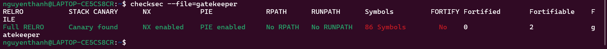

# Quizploit

```
#include <stdio.h>
#include <stdlib.h>

/*
This is not the challenge, just a template to answer the questions.
To get the flag, answer all the questions. 
There are no bugs in the quiz.
There are 0xD questions in total.

*/

void win(){
        system("cat flag.txt");
}

void vuln(){
        char buffer[0x15] = {0};
        fprintf(stdout, "\nEnter payload: ");
        fgets(buffer, 0x90, stdin);
}

void main(){
        vuln();
}
```

truy cập vào dịch vụ đc giao diện như này

<figure><figcaption></figcaption></figure>

bài bắt cta dựa vào source code và trả lời 13 câu hỏi&#x20;

<figure><figcaption></figcaption></figure>

dùng lệnh **file** để ktra&#x20;

<figure><figcaption></figcaption></figure>

⇒ 64-bit

<figure><figcaption></figcaption></figure>

dựa vào hint -> chương trình dùng các hàm thư viện chuẩn (`fprintf`, `fgets`, `system`) → cần **libc** bên ngoài → **dynamic**

<figure><figcaption></figcaption></figure>

Flag `-s` dùng để **xóa symbol (tên hàm)** khi compile

* Hint nói: không dùng **`-s` →** còn symbol
* Trong bài vẫn thấy `win`, `main`, `vuln`

->Binary không bị strip **⇒ not stripped**

<figure><figcaption></figcaption></figure>

xem trong hàm **vuln()**

```
char buffer[0x15] = {0};
```

⇒ **0x15**

<figure><figcaption></figcaption></figure>

xem trong hàm **vuln()**

```
fgets(buffer, 0x90, stdin);
```

⇒ **0x90**

<figure><figcaption></figcaption></figure>

Buffer: `0x15` (21 bytes) < Input đọc vào: `0x90` (144 bytes)

⇒ Input lớn hơn rất nhiều so với buffer dẫn đến dữ liệu sẽ ghi đè ra ngoài buffer

-> **yes**

<figure><figcaption></figcaption></figure>

có dòng code&#x20;

```
fgets(buffer, 0x90, stdin);
```

buffer có 0x15 mà đọc tận 0x90 ⇒ gây overflow

⇒ **fgets**

<figure><figcaption></figcaption></figure>

dựa vào code ta thấy:

\+ **main()** gọi **vuln()**

\+ **vuln()** gọi **fgets** và **fprintf**

\+ **win()** ko gọi gì cả

⇒ **win**

<figure><figcaption></figcaption></figure>

dựa vào bên trên ta thấy khi buffer là 0x15 mà input tận 0x90 điều này dẫn đến ghi đè lên stack -> lỗi của **buffer overflow**

<figure><figcaption></figcaption></figure>

0x90 - 0x15 = **0x7b**

<figure><figcaption></figcaption></figure>

dùng **checksec** với file **vuln**

<figure><figcaption></figcaption></figure>

ta thấy :

Partial RELRO
\
No canary found
\
**NX enabled**
\
No PIE

-> **NX**

<figure><figcaption></figcaption></figure>

**NX (Non-Executable) ngăn không cho thực thi code trên stack.**\
Điều này khiến việc chèn và chạy shellcode trực tiếp từ input là không thể.

Để vượt qua cơ chế bảo vệ này, ta sử dụng **ROP (Return-Oriented Programming)**.\
Thay vì chèn code mới, ROP tận dụng các đoạn code có sẵn (gadgets) trong binary hoặc thư viện để thực thi hành vi mong muốn.

⇒ **ROP**

<figure><figcaption></figcaption></figure>

tìm địa chỉ **win,** ta dùng lệnh **nm**

```
nm vuln | grep win
```

<figure><figcaption></figcaption></figure>

⇒ **0x401176**


Làm xong hết ta được flag

<figure><figcaption></figcaption></figure>
